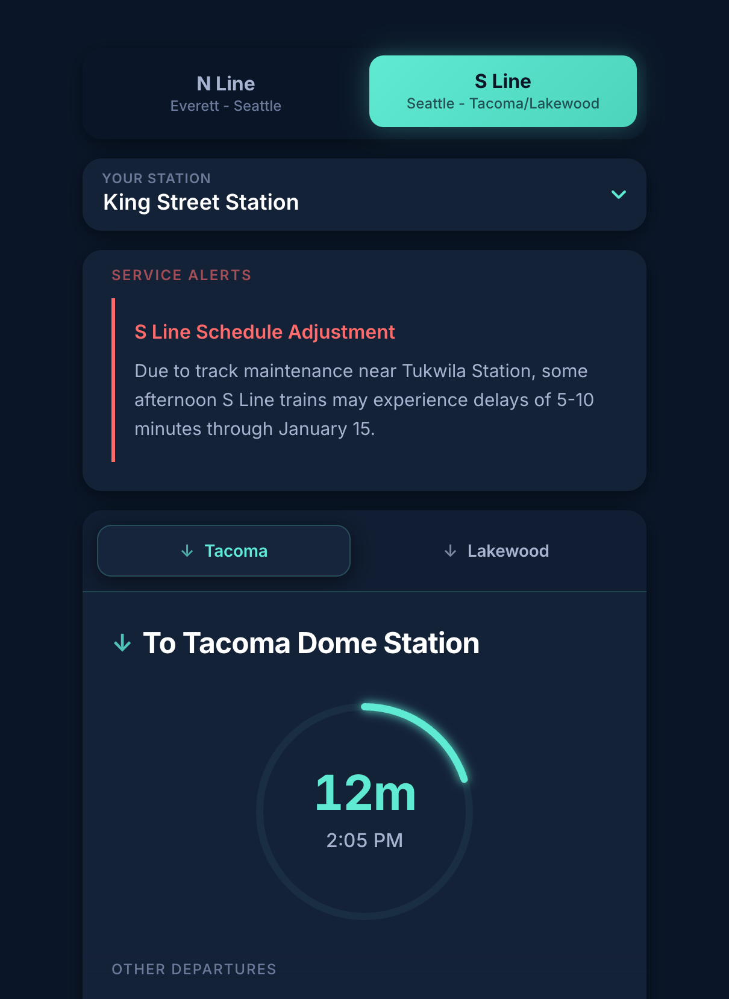
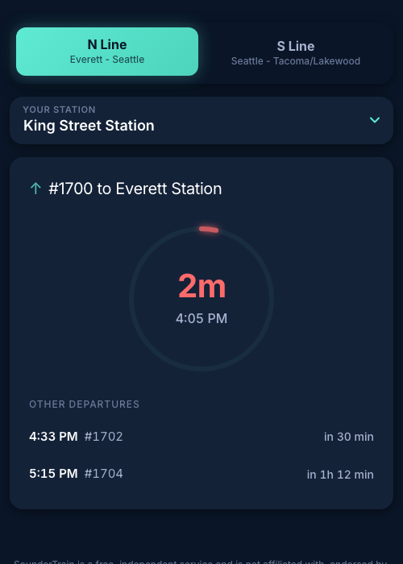

# Sounder Train Schedule

A fast, beautiful Progressive Web App for Seattle-area commuters to track Sound Transit Sounder train departures in real time.



## Why Use This App?

Sounder Train Schedule gives you exactly what you need to catch your train - nothing more, nothing less. See your next departure at a glance with a prominent countdown timer, check service alerts, and never miss a train again.

**Live App:** [soundertrain.com](https://www.soundertrain.com)

## Features

### Real-Time Countdown

The circular progress ring shows exactly how long until your next train. The countdown changes color based on urgency:

- **Red (2 min or less)** - Time to run!
- **Orange (3-5 min)** - Better hurry
- **Teal (6-15 min)** - Comfortable
- **Cyan (15+ min)** - Plenty of time



### Two Routes, All Stations

Choose between the **N Line** (Everett - Seattle) and **S Line** (Seattle - Tacoma/Lakewood). Select your departure station from the dropdown to see trains headed to all destinations from that stop.

When multiple destinations are available, tabs let you quickly switch between them (e.g., Tacoma vs. Lakewood on the S Line).

### Service Alerts

Live service alerts from Sound Transit appear automatically when there are delays, schedule changes, or other disruptions affecting your route.

### Works Offline

As a Progressive Web App, Sounder Train Schedule works even without an internet connection. Schedule data is cached locally, so you can check train times in tunnels, underground stations, or anywhere with spotty reception.

### Install on Your Phone

Add the app to your home screen for instant access:

**iOS:** Tap the Share button in Safari, then "Add to Home Screen"

**Android:** Tap the menu button in Chrome, then "Add to Home screen" or "Install app"

## For Developers

### Prerequisites

- Node.js 18+
- npm

### Getting Started

```bash
# Clone the repository
git clone https://github.com/JonEHolland/train-tool.git
cd train-tool

# Install dependencies
npm install

# Start development server
npm run dev
```

The app will be available at `http://localhost:5173`.

### Building

```bash
# Build for production
npm run build

# Fetch latest schedule data and build
npm run publish

# Preview production build
npm run preview
```

The build produces a single HTML file (~205KB) containing all code, styles, and schedule data.

### Testing

```bash
# Run unit tests
npm run test

# Run tests in watch mode
npm run test:watch

# Run end-to-end tests
npm run test:e2e
```

### Project Structure

```
src/
├── App.tsx              # Main component and schedule logic
├── schedule-data.json   # Processed GTFS schedule data
├── components/          # React UI components
│   ├── AlertList.tsx    # Service alerts display
│   ├── CircularProgress.tsx  # Countdown ring
│   ├── RouteSelect.tsx  # N/S Line toggle
│   ├── StopSelect.tsx   # Station dropdown
│   ├── TrainList.tsx    # Main train display
│   └── WeekendNotice.tsx
├── hooks/               # Custom React hooks
│   ├── useAlerts.ts     # Alert fetching
│   └── useLocalStorage.ts
├── utils/
│   ├── time.ts          # Time formatting
│   └── constants.ts     # Urgency thresholds
└── types.ts             # TypeScript interfaces

scripts/
├── fetch-gtfs.ts        # Downloads GTFS data from Sound Transit
└── update-sw-hash.ts    # Updates Service Worker cache version

public/
├── manifest.json        # PWA manifest
└── sw.js               # Service Worker for offline support
```

### Data Sources

Schedule data comes from Sound Transit's official GTFS feed:
- **Schedule:** `https://gtfs.sound.obaweb.org/prod/40_gtfs.zip`
- **Service Alerts:** `https://s3.amazonaws.com/st-service-alerts-prod/alerts_pb.json`

To update schedule data:

```bash
npm run fetch-data
```

### Tech Stack

- **React 18** with TypeScript for the UI
- **Vite 6** with single-file output for fast builds
- **GTFS** (General Transit Feed Specification) for schedule data
- **Service Worker** for offline support and PWA capabilities

## Deployment

The app automatically deploys to GitHub Pages when changes are pushed to `main`. The deployment workflow:

1. Fetches the latest GTFS schedule data
2. Builds the single-file PWA
3. Deploys to GitHub Pages

## Contributing

Contributions are welcome! Please feel free to submit issues and pull requests.

## Disclaimer

SounderTrain is a free, independent service and is not affiliated with, endorsed by, or connected to Sound Transit in any way. Schedule data is sourced from publicly available GTFS feeds and may not reflect real-time conditions. Use official Sound Transit resources for authoritative schedule information.

## License

MIT
